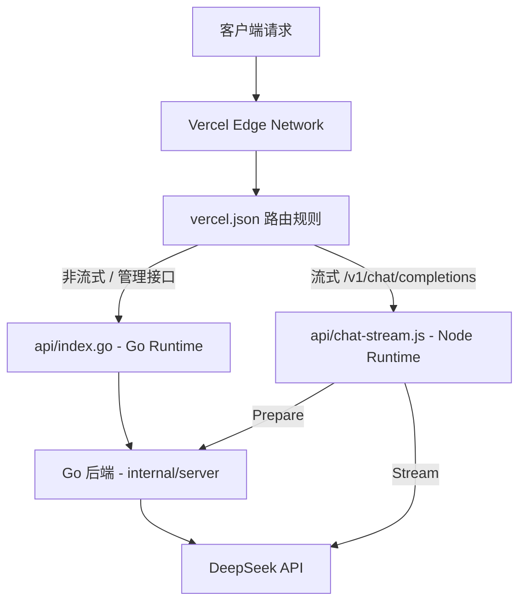

# EdgeOne Pages 部署支持 — 设计文档

## 概述

本文档详细描述 DS2API 项目从 Vercel Serverless 迁移到 EdgeOne Pages 的技术设计方案。基于 EdgeOne Pages 平台已支持 Go 运行时（包括 Chi、Gin、Echo、Fiber 等框架），设计采用 **EdgeOne Go Cloud Functions (Framework 模式) + Node Functions (流式代理)** 的纯边缘全托管架构。项目可一键部署到 EdgeOne Pages，无需外部服务器。

---

## 架构

### 当前 Vercel 架构



- 两个入口文件部署在同一 Vercel 项目中
- Go Runtime 处理所有非流式请求和管理接口
- Node Runtime 处理流式请求，通过内部 HTTP 调用 Go 后端获取准备信息后直连 DeepSeek
- 构建阶段：`npm ci --prefix webui && npm run build --prefix webui` → 输出到 `static/`

### 目标 EdgeOne 架构

```mermaid
graph TD
    Client[客户端请求] --> EO[EdgeOne Pages Edge Network]
    EO --> EORW[edgeone.json 路由规则]
    EORW -->|静态资源 /admin/*| Static[静态文件 - static/]
    EORW -->|REST API /v1/* /admin/*| GoCF[cloud-functions/index.go - Go Cloud Function (Chi)]
    EORW -->|流式 /v1/chat/completions| NodeFunc[functions/api/chat-stream.js - Node Function]
    GoCF --> GoApp[Go 后端 - internal/server]
    NodeFunc -->|Prepare / Release| GoCF
    NodeFunc -->|Stream| DS[DeepSeek API]
    GoApp --> DS
    Build[构建阶段] --> StaticOutput[static/ 目录]
    Build --> GoBinary[Go 编译产物]
    Build --> FuncOutput[functions/ 目录]
```

- **Go Cloud Functions (Framework 模式)**：使用现有 Chi 路由器的 Go 后端，以 `cloud-functions/index.go` 为入口，处理所有非流式 REST API 和管理接口
- **Node Functions**：处理流式 `/v1/chat/completions` 请求，内部调用 Go Cloud Function 获取准备信息，然后直连 DeepSeek 进行 SSE 流式转发
- **静态文件**：前端构建产物部署到 EdgeOne CDN
- 全部托管在 EdgeOne Pages 平台，零外部依赖

### 设计决策对比

| 方案 | 优点 | 缺点 | 结论 |
|------|------|------|------|
| **Go 外部部署 + Node Functions** | 改动最小 | 需要额外服务器，运营成本高 | ❌ |
| **Go Cloud Functions + Node Functions** | 完全托管，零运维，国内加速 | 需适配 Go 入口文件 | ✅ **采用** |

---

## 组件与接口

### 1. edgeone.json 配置文件

EdgeOne Pages 项目配置文件，放置于项目根目录，与 vercel.json 共存。

```json
{
  "buildCommand": "npm ci --prefix webui && npm run build --prefix webui -- --outDir ../static/admin --emptyOutDir",
  "installCommand": "npm ci --prefix webui",
  "outputDirectory": "static",
  "nodeVersion": "22.17.1",
  "rewrites": [
    {
      "source": "/v1/chat/completions",
      "destination": "/functions/api/chat-stream"
    },
    {
      "source": "/v1/*",
      "destination": "/cloud-functions/index"
    },
    {
      "source": "/admin/*",
      "destination": "/cloud-functions/index"
    },
    {
      "source": "/(.*)",
      "destination": "/cloud-functions/index"
    }
  ],
  "headers": [
    {
      "source": "/admin/assets/*",
      "headers": [
        { "key": "Cache-Control", "value": "public, max-age=31536000, immutable" }
      ]
    },
    {
      "source": "/admin/*",
      "headers": [
        { "key": "Cache-Control", "value": "no-store, must-revalidate" }
      ]
    }
  ],
  "node-functions": {
    "external_node_modules": [],
    "included_files": ["internal/js/**"]
  }
}
```

#### 与 vercel.json 的关键差异

| Vercel (vercel.json) | EdgeOne (edgeone.json) | 说明 |
|---|---|---|
| `"version": 2` | 不需要 | EdgeOne 不需要 version 字段 |
| `"functions": { ... "maxDuration": 300 }` | 不在配置文件中设置 | Go 函数默认 120s，满足需求 |
| `rewrites` 指向 `/api/index` | 指向 `/cloud-functions/index` | Go 入口从 Vercel Serverless 格式改为 EdgeOne Framework 模式 |
| `"has": [{ "type": "query", "key": "__go" }]` | 不支持 `has` 条件 | 通过路由分离：流式走 `/functions/api/chat-stream`，非流式走 `/cloud-functions/index` |
| 构建命令 | 添加 `--outDir ../static/admin` | 确保输出到项目根目录的 `static/admin/` |

### 2. Go Cloud Functions (Framework 模式)

#### 入口文件：cloud-functions/index.go

EdgeOne Pages 的 Go 运行时支持 Framework 模式。由于项目使用 Chi 框架，可直接以 Framework 模式部署。

**新建文件**：[`cloud-functions/index.go`](cloud-functions/index.go) — EdgeOne 专用入口

```go
package main

import (
    "net/http"
    "os"

    "ds2api/app"
    "ds2api/internal/config"
    "ds2api/internal/webui"
)

func main() {
    if err := config.LoadDotEnv(); err != nil {
        config.Logger.Warn("[dotenv] load failed", "error", err)
    }
    config.RefreshLogger()
    webui.EnsureBuiltOnStartup()

    h := app.NewHandler()

    port := os.Getenv("PORT")
    if port == "" {
        port = "9000"
    }

    if err := http.ListenAndServe(":"+port, h); err != nil {
        config.Logger.Error("server failed", "error", err)
        os.Exit(1)
    }
}
```

**关键设计决策**：

- **复用现有 `app.NewHandler()`**：该函数返回完整的 Chi 路由器（含所有 API 路由、中间件、CORS 配置等），无需修改
- **框架检测**：平台自动检测到 Chi 框架（通过 `go.mod` 中的依赖），使用 Framework 模式处理
- **端口**：EdgeOne 平台会注入 `PORT` 环境变量，默认使用 `9000` 作为 fallback
- **构建前缀**：文件名为 `index.go`，URL 前缀为 `/`，前端请求 `/v1/chat/completions` 直接路由到 Go 函数

#### 与现有 Vercel 入口的对比

| 方面 | Vercel (`api/index.go`) | EdgeOne (`cloud-functions/index.go`) |
|---|---|---|
| 模式 | Serverless Function (Handler) | Cloud Function (Framework) |
| 函数签名 | `func Handler(w, r)` | `func main()` |
| 端口 | 平台管理 | `http.ListenAndServe(":PORT", h)` |
| 构建 | 平台自动编译 | 平台自动交叉编译 |
| 导入路径 | `ds2api/app` | `ds2api/app` (相同) |

#### 保留 Vercel 入口不变

- [`api/index.go`](api/index.go:1) 保留不修改，确保 Vercel 部署路径继续工作
- [`cloud-functions/index.go`](cloud-functions/index.go) 是 EdgeOne 专用入口

### 3. Node.js Functions (流式代理)

#### 流式入口：functions/api/chat-stream.js

**新建文件**：[`functions/api/chat-stream.js`](functions/api/chat-stream.js) — EdgeOne 专用流式入口

**设计思路**：
- 从现有 [`internal/js/chat-stream/index.js`](internal/js/chat-stream/index.js:1) 和 Vercel 版 [`api/chat-stream.js`](api/chat-stream.js:1) 的流式处理逻辑出发，适配为 EdgeOne Pages Functions 格式
- 关键区别：EdgeOne Function 使用 `onRequestPost(context)` 签名 + 返回 `Response` 对象

**函数签名对比**：

```javascript
// Vercel 版本
module.exports = async function handler(req, res) { ... }

// EdgeOne 版本
export async function onRequestPost(context) {
  const { request, env } = context;
  // ... 业务逻辑 ...
}
```

**核心适配点**：

1. **导出方式**：`module.exports` → `export async function onRequestPost`
2. **参数获取**：`(req, res)` → `context.request`，通过 `context.env` 获取环境变量
3. **响应方式**：从直接操作 `res`（`res.writeHead`、`res.write`、`res.end`）改为返回 `Response` 对象（支持 `ReadableStream`）
4. **CORS**：在 `onRequestPost` 入口处理 OPTIONS 请求
5. **运行时检测**：新增 `isEdgeOneRuntime()`，通过 `process.env.EDGEONE_RUNTIME` 判断

**流适配**：EdgeOne 环境使用 Web Streams API (`TransformStream` / `ReadableStream`)：

```javascript
// 建立流管道
const { readable, writable } = new TransformStream();
const writer = writable.getWriter();

// 异步写入 SSE 数据
(async () => {
  // ... prepare via Go backend ...
  // ... stream from DeepSeek ...
  // ... write to writer ...
  await writer.close();
})();

// 返回流响应
return new Response(readable, {
  status: 200,
  headers: {
    'Content-Type': 'text/event-stream',
    'Cache-Control': 'no-cache, no-transform',
    'Connection': 'keep-alive',
    'X-Accel-Buffering': 'no',
  }
});
```

**内部调用 Go Cloud Function**：

```javascript
// EdgeOne 环境中，使用部署域名调用 Go Cloud Function
const goUrl = new URL(request.url);
goUrl.pathname = '/v1/chat/completions';
goUrl.searchParams.set('__go', '1');
goUrl.searchParams.set('__stream_prepare', '1');

const prep = await fetch(goUrl.toString(), {
  method: 'POST',
  headers: { /* forward relevant headers */ },
  body: rawBody,
});
```

#### 共享模块保持不变

- [`internal/js/chat-stream/`](internal/js/chat-stream/) 下的所有模块（SSE 解析、工具筛分、CORS、错误处理等）保持通用
- 在 `edgeone.json` 的 `node-functions.included_files` 中包含 `internal/js/**`，确保模块随函数部署

### 4. 构建流程

```
[Git Push]
  → EdgeOne Pages 自动触发构建
    1. 运行 installCommand: npm ci --prefix webui
    2. 运行 buildCommand: npm run build --prefix webui -- --outDir ../static/admin --emptyOutDir
    3. 检测 Go 框架，自动交叉编译 cloud-functions/index.go
    4. 打包 Node Functions (functions/ + internal/js/)
    5. 收集构建产物:
       ├── static/ (前端静态文件)
       ├── cloud-functions/ (Go 编译产物)
       ├── functions/ (Node 云函数)
       ├── internal/js/ (Node 函数依赖模块)
       └── edgeone.json (配置)
    → 部署到 EdgeOne 全球边缘节点
```

**关键文件布局**（部署后）：

```
cloud-functions/
  index.go              # Go Cloud Function 入口 (Chi Framework 模式)
functions/
  api/
    chat-stream.js      # 流式 SSE 代理 (EdgeOne 适配版)
internal/
  js/                   # Node.js 共享模块
    chat-stream/        # SSE 解析、工具筛分等
    helpers/            # 流式辅助工具
    shared/             # 共享常量
api/
  chat-stream.js        # Vercel 流式入口 (保留不动)
  index.go              # Vercel Go 入口 (保留不动)
static/
  admin/                # 前端构建产物
    index.html
    assets/
edgeone.json            # EdgeOne 配置文件
vercel.json             # Vercel 配置文件 (保留不动)
```

---

## 数据模型

### 环境变量

EdgeOne Pages 支持通过控制台设置环境变量，在 Functions 中通过 `context.env` 或 `process.env` 访问。

| 变量 | 用途 | 必需 | 说明 |
|------|------|------|------|
| `DS2API_ADMIN_KEY` | 管理密钥 | ✅ | Node Function 调用 Go 内部接口时使用 |
| `DS2API_CONFIG_JSON` | 完整配置 (Base64) | 建议 | 包含账号、API Key 等业务配置 |
| `DS2API_ACCOUNT_MAX_INFLIGHT` | 每账号并发上限 | — | 默认 `2` |
| `DS2API_GLOBAL_MAX_INFLIGHT` | 全局并发上限 | — | 默认自动计算 |
| `PORT` | Go 函数监听端口 | — | 平台自动注入 |
| `VERCEL_TOKEN` | Vercel 同步 token | — | WebUI Vercel 同步功能 (可选) |
| `VERCEL_PROJECT_ID` | Vercel 项目 ID | — | 同上 |
| `VERCEL_TEAM_ID` | Vercel 团队 ID | — | 同上 |

### 配置文件

- `edgeone.json` 与 `vercel.json` 在仓库中共存
- EdgeOne 自动识别 `edgeone.json`，Vercel 自动识别 `vercel.json`
- 互不干扰，部署到不同平台时各自生效

---

## 错误处理

### 流式处理错误

| 错误场景 | 处理方式 |
|----------|----------|
| Go Cloud Function 不可达 | Node Function 捕获 fetch 异常，返回 502 错误 SSE |
| DeepSeek 上游错误 | 返回 OpenAI 格式错误 SSE（逻辑不变） |
| 客户端断开 | 中止上游请求，释放 Go 后端 lease |
| 空输出 | 重试最多 1 次，返回 429 错误 SSE |
| 超时 | 平台限制：Go Function 120s，Node Function 30s |

### 非流式处理错误

- 由 Go Cloud Function 内部处理，与现有 Vercel 行为一致
- Go 内部错误（配置错误、账号池耗尽等）透传原有错误响应

---

## 测试策略

### 单元测试

1. **`isEdgeOneRuntime()` 检测逻辑测试**：验证在 EdgeOne 环境中正确识别
2. **Go 入口编译测试**：验证 `cloud-functions/index.go` 在 EdgeOne 构建环境中成功编译
3. **Node Function 适配测试**：验证 `onRequestPost` 函数签名、`context` 解析、`Response` 返回

### 集成测试

1. **端到端测试**：EdgeOne 预览环境完整请求链路验证
2. **流式兼容性测试**：SSE 流式转发行为与 Vercel 一致
3. **工具调用测试**：验证 tools 筛分在 EdgeOne 环境下的一致性

### 性能测试

1. 对比 Vercel 与 EdgeOne 部署的响应延迟
2. 记录不同地区（中国、海外）的延迟基线

---

## 实施优先级

| 阶段 | 任务 | 优先级 |
|------|------|--------|
| Phase 1 | 创建 `cloud-functions/index.go` Go 入口 | 🔴 高 |
| Phase 2 | 创建 `functions/api/chat-stream.js` Node 流式函数 | 🔴 高 |
| Phase 3 | 创建 `edgeone.json` 配置文件 | 🔴 高 |
| Phase 4 | 适配 `isEdgeOneRuntime()` 运行时检测 | 🟡 中 |
| Phase 5 | 更新 `docs/DEPLOY.md` 部署文档 | 🟡 中 |
| Phase 6 | 编写自动化测试 | 🟢 低 |
